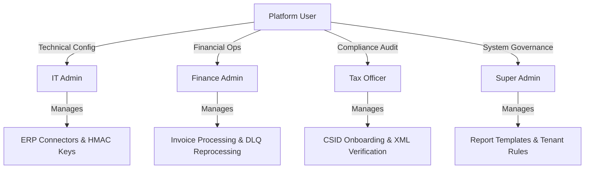

# Product Requirements Document (PRD)
## ZatcaConnect: ZATCA Phase-2 e-Invoicing Compliance Platform

| Metadata | Details |
| :--- | :--- |
| **Document Version** | 1.0.0-RC1 |
| **Product Name** | ZatcaConnect (EasyLease Tax Application) |
| **Status** | Approved for QA Handover |
| **Target Release** | Phase 2 Fatoora Integration Mandate |
| **Author / Generator** | Antigravity (`prd-writer` skill) |

---

## 1. Executive Summary & Business Goals

The Saudi Zakat, Tax and Customs Authority (ZATCA) mandated the implementation of electronic invoicing (Fatoora) across the Kingdom of Saudi Arabia in two phases. While Phase 1 (Generation) required local archiving and simple QR codes, **Phase 2 (Integration Mandate)** requires direct, cryptographic integration between taxpayer enterprise resource planning (ERP) systems and ZATCA's central core processing platform.

**ZatcaConnect** serves as an enterprise-grade middleware and compliance gateway. It isolates ERP systems (such as Microsoft Dynamics 365, Odoo, SAP, and custom POS systems) from the complex cryptographic, XML UBL 2.1 serialization, and API communication protocols mandated by ZATCA. 

### Key Business Objectives:
* **Zero Non-Compliance Risk**: Ensure 100% adherence to ZATCA XML formatting, cryptographic hashing, and signature standards.
* **Seamless ERP Interoperability**: Provide standardized RESTful APIs authenticated via HMAC-SHA256 for rapid ERP integration without modifying core ERP database structures.
* **Zero-Downtime Resilience**: Buffer invoice transmissions during ZATCA portal downtime or network outages via an automated Dead Letter Queue (DLQ) and exponential backoff retry mechanism.
* **Multi-Tenant & Multi-Environment Isolation**: Support independent lifecycle management across **Simulation**, **Sandbox**, and **Production** ZATCA environments for multiple company VAT registrations and branch CSIDs.

---

## 2. User Personas & Roles

ZatcaConnect defines role-based access control (RBAC) across four distinct operational personas:

| Persona | Primary Responsibilities | Key System Interactions |
| :--- | :--- | :--- |
| **IT Admin** | System integration, API security, network connectivity, and ERP connector provisioning. | Generates API keys, configures webhook endpoints, monitors API latency, and views system logs (`/api/erp/config`). |
| **Finance Admin** | Day-to-day invoice tracking, failed transaction resolution, and billing reconciliation. | Monitors dashboard KPIs, reviews `FAILED` or `DLQ` invoices, manually triggers DLQ reprocessing (`/api/zatca/dlq/reprocess`), and exports tax summaries. |
| **Tax Officer** | Regulatory compliance, cryptographic certificate lifecycle, and ZATCA audit readiness. | Initiates CSID onboarding (`/csid/compliance`), requests production CSIDs, inspects cleared XML payloads, and verifies TLV QR codes. |
| **Super Admin** | Platform-wide governance, report template building, and tenant administration. | Creates custom reporting templates (`/api/reports/templates`), deactivates non-compliant companies, and executes system-wide audits. |

---

## 3. Problem Statement & Solution Architecture

### The Problem
Integrating ERP systems directly with ZATCA Phase-2 introduces severe engineering hurdles:
1. **Complex Cryptography**: Generating ECDSA secp256k1 keypairs, building X.509 Certificate Signing Requests (CSRs), and calculating SHA-256 XML digests requires specialized cryptographic libraries often unsupported by legacy ERPs.
2. **Strict UBL 2.1 XML Schemas**: ZATCA requires highly specific XML namespaces, XPath structures, and validation rules that vary between B2B Standard and B2C Simplified invoices.
3. **Synchronous Clearance Bottlenecks**: B2B invoices must be cleared synchronously by ZATCA *before* being issued to the buyer. If the tax portal experiences latency, ERP checkout workflows stall.

### The Solution
ZatcaConnect acts as an asynchronous/synchronous compliance bridge:
* Receives simplified JSON payloads from ERPs via authenticated REST push/pull endpoints.
* Automatically translates JSON into compliant UBL 2.1 XML.
* Generates cryptographic stamps, calculates previous invoice hashes (chaining), and embeds TLV Base64 QR codes.
* Routes invoices to the appropriate ZATCA environment and handles synchronous clearance or asynchronous reporting.

---

## 4. Functional Scope & Capabilities

### 4.1 Environment Isolation & Routing
The platform must maintain strict cryptographic and network isolation across three environments:
* **SIMULATION**: Uses local or ZATCA simulation endpoints (`/e-invoicing/simulation`) for testing developer logic without ZATCA credentials.
* **SANDBOX**: Connects to ZATCA developer portal (`/e-invoicing/developer-portal`) using test compliance CSIDs.
* **PRODUCTION**: Connects to ZATCA core live portal (`/e-invoicing/core`) using production CSIDs and strict TLS enforcement.

### 4.2 CSID Onboarding Lifecycle
* **CSR Generation**: Automated generation of secp256k1 elliptic curve keypairs and base64-encoded CSRs containing mandatory Organization Name, VAT Number (15 digits starting/ending with 3), Branch Name, and Serial Number.
* **Compliance Onboarding**: Submission of CSR + OTP to obtain a Compliance CSID and Request ID.
* **Compliance Testing**: Automated execution of ZATCA compliance checks (Standard Invoices, Simplified Invoices, Credit Notes, Debit Notes).
* **Production Onboarding**: Exchange of tested Compliance Request ID for a live Production CSID and API Secret.
* **Automated Renewal**: Proactive tracking of CSID expiry dates with automated renewal triggers (`/api/zatca/renew`).

### 4.3 Invoice Processing & Types
The platform supports three distinct document categories across three transaction types:

| Document Type | ZATCA Code | Processing Flow | Mandatory Requirements |
| :--- | :--- | :--- | :--- |
| **Standard Invoice (B2B)** | `388` (Subtype `0100000`) | **Clearance** (Real-time prior to issuance) | Buyer VAT number, XML digital signature, ZATCA cryptographic stamp in response. |
| **Simplified Invoice (B2C)**| `388` (Subtype `0200000`) | **Reporting** (Within 24 hours of issuance)| Cryptographic stamp generated locally by ZatcaConnect, embedded TLV QR Code. |
| **Credit / Debit Notes** | `381` / `383` | Clearance (B2B) or Reporting (B2C) | Reference to original invoice number, billing reference reason code. |

### 4.4 Cryptographic Stamping & QR Codes
For B2C Simplified invoices, ZatcaConnect must generate a Type-Length-Value (TLV) Base64 encoded QR code containing:
1. Seller Name (Tag 1)
2. VAT Registration Number (Tag 2)
3. Timestamp (Tag 3)
4. Invoice Total Amount with VAT (Tag 4)
5. VAT Amount (Tag 5)
6. XML SHA-256 Hash (Tag 6)
7. ECDSA Signature (Tag 7)
8. ECDSA Public Key (Tag 8)
9. ZATCA Cryptographic Stamp Signature (Tag 9)

---

## 5. Non-Functional Requirements (NFRs)

| Category | Metric / Requirement | Target SLA / Threshold |
| :--- | :--- | :--- |
| **Performance** | B2B Clearance API Response Time | `< 2000ms` (95th percentile) from ERP push to ZATCA clearance response. |
| **Performance** | XML Serialization & Hashing Speed | `< 150ms` per invoice payload locally. |
| **Availability** | Platform Uptime | `99.9%` uptime excluding scheduled maintenance windows. |
| **Reliability** | DLQ Delivery Guarantee | `100%` eventual reporting for B2C invoices within ZATCA's 24-hour regulatory window. |
| **Security** | Secret Encryption at Rest | All CSID secrets, private keys, and ERP API keys must be encrypted in PostgreSQL using AES-256-GCM. |
| **Security** | Transport Security | HTTPS / TLS 1.3 mandatory for all external communications. |
| **Auditability** | Tamper-Proof Audit Logging | 100% of API requests, ZATCA responses, and auth failures logged to `audit_logs` table with SHA-256 checksums. |

---

## 6. Assumptions & Out-of-Scope

### Assumptions
* The taxpayer ERP system is capable of sending JSON HTTP POST requests or exposing an OData/REST endpoint for pull synchronization.
* The taxpayer possesses a valid 15-digit Saudi VAT registration number and access to the ZATCA Fatoora portal to generate OTPs.

### Out-of-Scope
* Core ERP accounting logic (general ledger posting, inventory deduction, tax calculation algorithms).
* Physical printer integration for point-of-sale (POS) receipt printing (ZatcaConnect provides Base64 QR codes and PDF renderings, but printing hardware is managed by the client).
