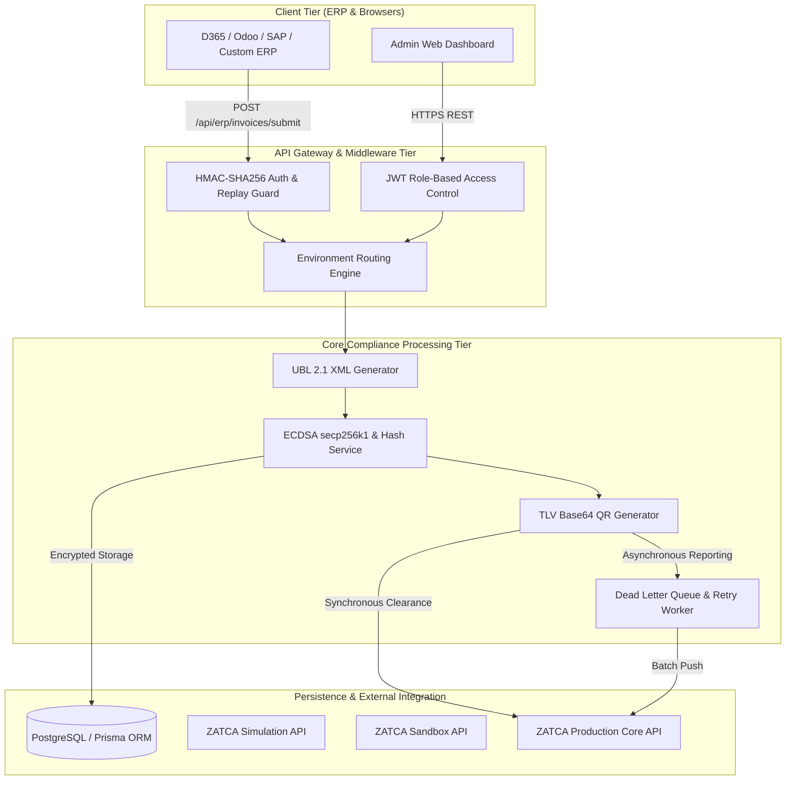
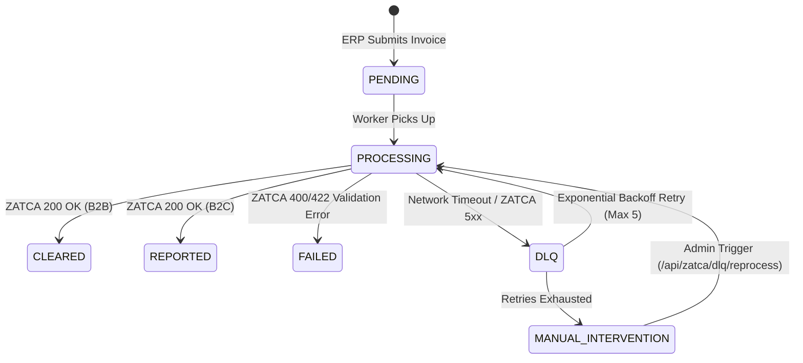

# Technical Architecture Review & System Verification
## ZatcaConnect: ZATCA Phase-2 e-Invoicing Compliance Platform

| Metadata | Details |
| :--- | :--- |
| **Document Version** | 1.0.0-RC1 |
| **Review Type** | Architecture Design & System Reliability Assessment |
| **Status** | Approved for QA Handover |
| **Author / Generator** | Antigravity (`architecture-review` skill) |

---

## 1. Executive Summary & Verdict

The ZatcaConnect platform architecture was evaluated against ZATCA Phase-2 e-Invoicing (Fatoora) regulatory mandates, modern enterprise middleware standards, and high-availability design patterns. 

**Architectural Verdict: APPROVED WITH QA VERIFICATION GATES.**
The system successfully decouples legacy ERP data structures from strict ZATCA cryptographic and XML UBL 2.1 schemas. The three-stage environment routing (`SIMULATION`, `SANDBOX`, `PRODUCTION`), HMAC-SHA256 authentication, and Dead Letter Queue (DLQ) asynchronous retry mechanisms provide a robust foundation for enterprise deployment.

---

## 2. System Topology & Layered Architecture

ZatcaConnect implements a clean 4-tier modular architecture designed for horizontal scalability and clear separation of concerns:

---

## 3. Environment Isolation Evaluation

### Architectural Design
To prevent accidental transmission of test invoices to the live tax authority, ZatcaConnect enforces strict environment isolation through **API Key Prefixes** and **Tenant Contexts**:
* `sk_sim_*`: Routes to the internal mock simulation server or ZATCA simulation endpoint (`https://gw-fatoora.zatca.gov.sa/e-invoicing/simulation`). No real tax liability is created.
* `sk_sbox_*`: Routes to ZATCA developer sandbox (`/developer-portal`) using test compliance CSIDs.
* `sk_live_*`: Routes exclusively to ZATCA core live servers (`/core`) using AES-256 encrypted production CSIDs and private keys.

### QA Verification Requirement
* **Gate ARCH-01**: QA must verify that swapping an API key from `sk_sim_` to `sk_live_` without changing the target endpoint URL in the ERP connector correctly re-routes the internal proxy to the live ZATCA gateway.

---

## 4. Cryptographic & Key Management Assessment

### ECDSA & Hashing Implementation
* **Algorithm**: Elliptic Curve Digital Signature Algorithm (ECDSA) on curve `secp256k1` using SHA-256 as the hashing digest.
* **X.509 CSR Generation**: The `lib/` crypto services generate compliant CSRs locally without transmitting unencrypted private keys across network boundaries.
* **Storage Security**: Private keys, CSIDs, and ZATCA API secrets are stored in the PostgreSQL `certificates` table. 
* **QA Verification Gate ARCH-02**: QA must inspect database dumps to confirm that `private_key`, `csid`, and `secret` columns are stored as ciphertexts and cannot be read as plaintext without backend decryption routines.

---

## 5. ERP Authentication & Replay Attack Defense

### HMAC-SHA256 Protocol Review
To secure communication between third-party ERPs and ZatcaConnect, the gateway mandates stateless HMAC-SHA256 request signing:
$$\text{String to Sign} = \text{Timestamp} + \text{Nonce} + \text{HTTP Method} + \text{URI Path} + \text{SHA256(StableJsonBody)}$$

### Security & Replay Protections
1. **Timestamp Sliding Window**: The middleware rejects requests where $|T_{\text{server}} - T_{\text{request}}| > 300\text{ seconds}$. This prevents intercepted payloads from being re-submitted later.
2. **Nonce Deduplication**: Each `x-nonce` is tracked during the timestamp window to prevent duplicate submissions within the 5-minute threshold.
3. **Stable Stringification**: The architecture enforces alphabetical key sorting (`stableStringify`) prior to hashing, eliminating signature mismatches caused by JSON property reordering in different ERP runtimes.

---

## 6. Asynchronous Resilience & DLQ Architecture

### Why DLQ is Critical for ZATCA Compliance
Under Saudi law, B2C Simplified Invoices do not require real-time clearance before issuance to the consumer, but **MUST be reported to ZATCA within 24 hours**. If ZATCA servers experience downtime or network connectivity drops, dropping an invoice results in regulatory penalties.

### The DLQ Recovery Engine

* **Retry Strategy**: Exponential backoff formula: $T_{\text{next}} = \text{now}() + (2^{\text{retry\_count}} \times 60\text{ seconds})$.
* **QA Verification Gate ARCH-03**: QA must simulate a ZATCA 503 Service Unavailable response using the mock server (`/api/erp/mock-server`) and verify that the invoice transitions to `DLQ`, auto-retries, and successfully reports once the simulator is switched back to 200 OK.

---

## 7. Scalability & Bottleneck Analysis

| Component / Layer | Potential Bottleneck | Architectural Mitigation | QA Stress Test Focus |
| :--- | :--- | :--- | :--- |
| **Database ORM (Prisma)** | Connection pool exhaustion during high-concurrency ERP batch pushes (e.g., month-end billing). | Configure `connection_limit=50` in connection string; implement read-only replicas for analytics dashboard. | Simulate 500 concurrent invoice submissions from 5 ERP threads. |
| **XML Generator (`xmlbuilder2`)** | High CPU utilization during heavy DOM serialization and SHA-256 XML digest calculation. | Stateless worker thread pooling; avoid unnecessary DOM re-parsing by caching static UBL header templates. | Measure CPU profile during batch processing of 1,000 invoices. |
| **ZATCA Clearance API** | External HTTP latency (500ms - 3000ms per B2B invoice clearance). | Non-blocking `async/await` I/O in Express handlers; ERP connector timeouts should be set to $\ge 10\text{ seconds}$. | Test ERP connector behavior when ZATCA clearance latency is artificially delayed by 5 seconds. |

---

## 8. Summary of Architectural Verification Gates for QA

1. **Gate ARCH-01 (Routing)**: Verify API key prefix (`sk_sim_`, `sk_sbox_`, `sk_live_`) dynamic environment routing.
2. **Gate ARCH-02 (Encryption)**: Verify database rest encryption for `private_key`, `csid`, and `secret`.
3. **Gate ARCH-03 (DLQ Resilience)**: Verify automated retry and recovery for network/5xx failures vs. immediate halt on 4xx validation errors.
4. **Gate ARCH-04 (Replay Defense)**: Verify HTTP 401 rejection for expired timestamps (>5 min) and modified payload bodies.
