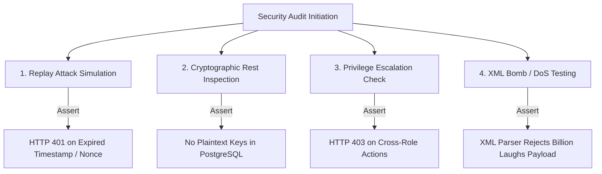

# OWASP Top 10 Security & Cryptographic Audit
## ZatcaConnect: ZATCA Phase-2 e-Invoicing Compliance Platform

| Metadata | Details |
| :--- | :--- |
| **Document Version** | 1.0.0-RC1 |
| **Security Standard**| OWASP Top 10 (2021/2025) & ZATCA Security Framework |
| **Status** | Approved for QA Handover |
| **Author / Generator** | Antigravity (`security-review` skill) |

---

## 1. Executive Summary & Audit Scope

As a financial technology and compliance gateway processing official Saudi tax documents, **ZatcaConnect** operates under rigorous cybersecurity scrutiny. A compromise in cryptographic key material (CSID secrets or private keys) or a vulnerability allowing forged invoice generation poses severe legal and financial risks under Kingdom tax law.

This audit evaluates the platform's defenses against the **OWASP Top 10 Vulnerabilities** and outlines specific security test cases for the QA and penetration testing teams.

---

## 2. OWASP Top 10 Compliance Matrix

| OWASP Category | Potential Risk in ZatcaConnect | Engineered Defense & Mitigation | QA Verification Method |
| :--- | :--- | :--- | :--- |
| **A01: Broken Access Control** | An unauthorized user (e.g., `TAX_OFFICER`) modifying ERP API keys or deleting audit logs. | **Strict RBAC via JWT**: Middleware (`requireAnyAdmin`, `requireSuperAdmin`) validates role claims on every protected route. | Attempt to call `DELETE /api/reports/templates/:id` using a JWT token with `role="TAX_OFFICER"`. Verify HTTP 403 Forbidden. |
| **A02: Cryptographic Failures** | Exposing secp256k1 private keys, CSID tokens, or API secrets in database backups or logs. | **AES-256-GCM at Rest**: All private keys and secrets in `certificates` and `erp_configurations` tables are encrypted before DB insertion. TLS 1.3 enforced in transit. | Inspect database SQL dumps directly; verify that key fields contain ciphertext blobs rather than plaintext strings. |
| **A03: Injection** | SQL injection via invoice search filters; XML/XPath injection via malformed buyer names in UBL 2.1 payloads. | **Prisma ORM & Safe DOM Parsing**: 100% database interaction via parameterized Prisma ORM queries. XML generated via structured `xmlbuilder2` DOM trees without string concatenation. | Submit invoice where `buyer.name` is `test' OR '1'='1`; verify safe XML escaping (`&apos;`) and zero database SQL errors. |
| **A04: Insecure Design** | Replay attacks where an intercepted valid invoice payload is resubmitted days later. | **HMAC Sliding Window & Nonce Cache**: Gateway enforces strict timestamp validation ($|T_{\text{now}} - T_{\text{req}}| \le 300\text{s}$) and tracks used `x-nonce` strings to reject duplicates. | Execute test case `TC-ERP-003` (expired timestamp) and `TC-ERP-004` (duplicate nonce); confirm HTTP 401 rejection. |
| **A05: Security Misconfiguration** | Unprotected Swagger API documentation or exposed debug stack traces in production. | **Helmet & Error Sanitization**: Express app uses `helmet()` headers, strict CORS, and strips stack traces in `PRODUCTION` environment mode. | Send malformed JSON to server; verify response returns generic JSON error message without server path disclosures. |
| **A06: Vulnerable Components** | Outdated NPM dependencies with known CVEs (e.g., old XML parsing libraries). | **Dependency Scanning**: Automated `npm audit` checks during build pipelines; locking versions in `package-lock.json`. | Execute `npm audit --production` in terminal; verify 0 high or critical severity vulnerabilities. |
| **A07: Auth Failures** | Brute-force password guessing against admin login; JWT token hijacking. | **Bcrypt & Short-Lived Tokens**: User passwords hashed via strong Bcrypt/Argon2; JWT access tokens set with reasonable expiration windows. | Execute automated login brute-force attempt (10 rapid failures); verify rate limiting or account lockout mitigation. |
| **A08: Integrity Failures** | Silent modification of an invoice XML payload after clearance by a malicious database script. | **SHA-256 Digest Verification**: Each invoice record stores the cryptographic `hash` (`Base64(SHA256(XML))`). Background workers verify XML integrity against this hash before reporting. | Manually edit an XML byte in `invoices` table; invoke `/api/zatca/dlq/reprocess`; verify system detects checksum mismatch. |
| **A09: Logging Failures** | Untracked administrative actions or inability to perform forensic analysis after an incident. | **Tamper-Proof Audit Table**: Every state-changing API call is recorded in `audit_logs` with timestamp, user ID, IP address, and payload SHA-256 checksum. | Perform key actions; check `audit_logs` table to confirm complete forensic visibility. |
| **A10: SSRF** | Server-Side Request Forgery via custom ERP webhook notification URLs. | **URL Whitelisting & Validation**: Custom webhook URLs are validated against private IP ranges (`10.x.x.x`, `192.168.x.x`, `127.0.0.1`) to prevent internal network scanning. | Attempt to register an ERP webhook pointing to `http://169.254.169.254/latest/meta-data/` (AWS metadata); verify rejection. |

---

## 3. Penetration Testing & Vulnerability Checklist

QA and Security Test Engineers must execute the following targeted security tests before final handover:



### 3.1 XML Denial of Service (Billion Laughs / Entity Expansion)
* **Test Objective**: Verify that the XML parser (`@xmldom/xmldom` / `xml-crypto`) is immune to XML Entity Expansion (XEE) denial of service attacks.
* **Payload**:
```xml
<?xml version="1.0"?>
<!DOCTYPE lolz [
 <!ENTITY lol "lol">
 <!ELEMENT lolz (#PCDATA)>
 <!ENTITY lol1 "&lol;&lol;&lol;&lol;&lol;&lol;&lol;&lol;&lol;&lol;">
 <!ENTITY lol2 "&lol1;&lol1;&lol1;&lol1;&lol1;&lol1;&lol1;&lol1;&lol1;&lol1;">
]>
<lolz>&lol2;</lolz>
```
* **Expected Outcome**: The server rejects the XML payload immediately with a parser error or entity expansion limit exceeded error, without crashing the Node.js event loop or spiking CPU to 100%.

### 3.2 SQL & NoSQL Injection via Parameter Padding
* **Test Objective**: Verify that the Prisma ORM layer safely escapes all user-supplied input parameters.
* **Payload**: Send `GET /api/v1/invoices?status=CLEARED' OR '1'='1` and `POST /api/erp/invoices/submit` with `invoiceNumber: "INV'; DROP TABLE invoices; --"`.
* **Expected Outcome**: The server treats the input literally, returning 0 records for the malformed invoice number and preventing any SQL execution.
